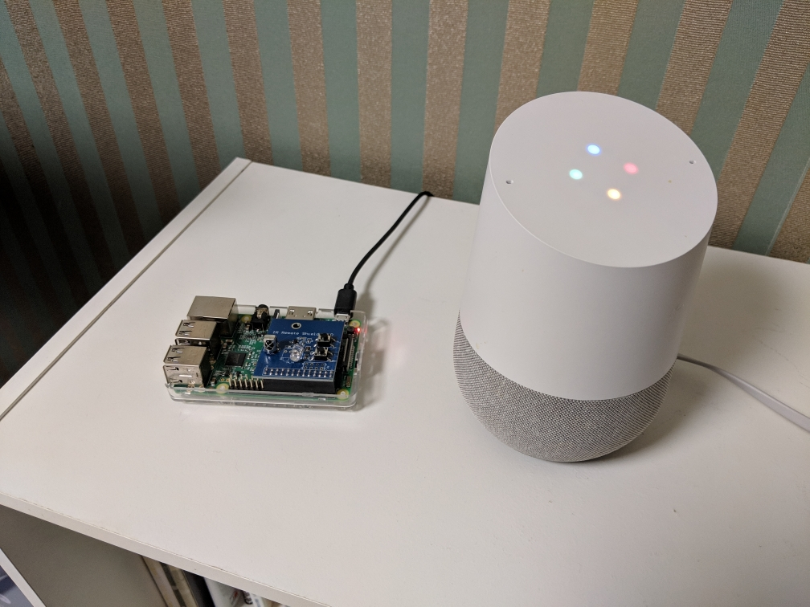

# IR remote with Raspberry pi and Google Home



## Hardware Setup

1. Raspberry Pi
2. IR Infrared Remote Control Transceiver Shield for Raspberry Pi (https://www.amazon.com/WINGONEER-Infrared-Control-Transceiver-Raspberry/dp/B072QWXLK2)
3. Google Home
4. Air Conditioner

## LIRC Installation

Follow step 23 in the following link:

https://www.instructables.com/id/Google-Home-Raspberry-Pi-Power-Strip/

## Test IR LED

Follow step 24 of the previous link. To ease the process, the commands are listed below.

    $ cd /etc/lirc/lircd.conf.d/
    $ sudo wget -O test.conf https://sourceforge.net/p/lirc-remotes/code/ci/master/tree/remotes/samsung/00056A.lircd.conf?format=raw

    $ sudo systemctl stop lircd
    $ sudo systemctl start lircd

    $ irsend SEND_ONCE Samsung_00056A KEY_POWER

## TEST IR Receiver with a remote control

Type the command below to read the IR signal coming from a remote control.

    $ sudo mode2 -d /dev/lirc0

Then press any button of the remote control. It will print data as below:

    space 8979
    pulse 4451
    space 588
    pulse 93409
    space 8981
    pulse 4444
    space 584
    pulse 93412

## Record TV Remote Control

Just for reference, if you want to record the signals of a TV remote control (easier), follow step 25 of the previous link. A summary of the commands are show below:

Return to root

    $ cd

Stop lircd if it was running

    $ sudo kill $(pidof lircd)

Start recording without namespace

    $ sudo irrecord --disable-namespace

Follow instructions on screen

Copy the generated file to '/etc/lirc/lircd.conf.d/' substituting 'File_name' by the name of the file you generated.

    $ sudo cp File_name.lircd.conf /etc/lirc/lircd.conf.d/

## Record Air Conditioner Remote Control

Air conditioner remote controls do not send signals related to just one button like TV remotes.
Instead, it sends a signal with the whole air conditioner configuration including temperature, airflow, air direction, etc.
The A/C message is very long, so the irrecord command does not work properly.

To record the A/C IR signal then, the steps shown in https://craftzdog.hateblo.jp/entry/control-an-air-conditioner-with-voice-from-google-home-via-raspberry-pi has to be followed.
Since the website is in Japanese, the steps are summarized below:

1. Type the following command to stop the LIRC systemd service and read the IR signals sent.
```
    $ sudo systemctl stop lircd
    $ mode2 -m -d /dev/lirc0
```
2. Press the ON and OFF button of the A/C remote. Two signals similar to the following will be obtained:
```
    4989552

        4369     4418      525     1640      579     1587
        527     1639      526     1648      520      554
        526      557      526     1640      527      555
        526      555      534      548      532      551
        533      550      525     1642      525     1639
        531      552      525     1641      527      555
        528      557      523      555      527      554
        527      557      526      556      525     1649
        518     1641      525     1641      528     1639
        580     1586      527     1639      527     1641
        527     1638      582      501      525      557
        526      554      528      555      527      555
        526      555      526      557      534      547
        528      552      528     1640      527     1639
        527      556      581      501      526      555
        526      557      526      554      527      556
        526      556      525      557      526      555
        527      555      526      556      527      555
        526      559      523      555      582     1585
        526      557      525      553      530      557
        524      555      527      562      574      502
        579      501      528      555      529     1638
        579      502      527      556      525      556
        526      556      526      555      527      556
        527      555      526     5338     4381     4409
        609     1559      579     1588      580     1585
        527     1637      530      554      526      556
        527     1638      538      543      528      555
        528      560      522      555      526      554
        529     1639      581     1586      527      563
        524     1634      527      555      529      551
        537      547      526      555      527      563
        517      558      526     1646      521     1639
        528     1641      525     1640      586     1580
        527     1640      525     1641      525     1643
        525      562      517      558      527      553
        584      500      528      555      525      556
        527      554      527      555      527      554
        526     1640      583     1583      529      555
        527      555      526      556      525      556
        525      557      526      556      526      556
        527      555      526      563      572      502
        527      556      580      501      527      555
        526      555      527     1640      527      554
        582      501      526      555      527      555
        527      557      525      555      580      501
        580      503      527     1639      582      500
        583      500      526      555      526      556
        582      500      527      555      526      556
        526
```
3. Create a file called `aircon.lircd.conf` in `/etc/lirc/lircd.conf.d/` and add the IR signals obtained when pressed the button ON and OFF of the A/C remote after `name on` and `name off` respectively. The first number of the signal series should be left off since it is the time the system waited for the next command.

    ```javascript
    begin remote

    name   aircon
    flags  RAW_CODES
    eps     30
    aeps   100

    ptrail   0
    repeat 0 0
    gap 28205
    frequency    38000

    begin raw_codes

        name on
            4369     4418      525     1640      579     1587
            527     1639      526     1648      520      554
            526      557      526     1640      527      555
            526      555      534      548      532      551
            533      550      525     1642      525     1639
            531      552      525     1641      527      555
            528      557      523      555      527      554
            527      557      526      556      525     1649
            518     1641      525     1641      528     1639
            580     1586      527     1639      527     1641
            527     1638      582      501      525      557
            526      554      528      555      527      555
            526      555      526      557      534      547
            528      552      528     1640      527     1639
            527      556      581      501      526      555
            526      557      526      554      527      556
            526      556      525      557      526      555
            527      555      526      556      527      555
            526      559      523      555      582     1585
            526      557      525      553      530      557
            524      555      527      562      574      502
            579      501      528      555      529     1638
            579      502      527      556      525      556
            526      556      526      555      527      556
            527      555      526     5338     4381     4409
            609     1559      579     1588      580     1585
            527     1637      530      554      526      556
            527     1638      538      543      528      555
            528      560      522      555      526      554
            529     1639      581     1586      527      563
            524     1634      527      555      529      551
            537      547      526      555      527      563
            517      558      526     1646      521     1639
            528     1641      525     1640      586     1580
            527     1640      525     1641      525     1643
            525      562      517      558      527      553
            584      500      528      555      525      556
            527      554      527      555      527      554
            526     1640      583     1583      529      555
            527      555      526      556      525      556
            525      557      526      556      526      556
            527      555      526      563      572      502
            527      556      580      501      527      555
            526      555      527     1640      527      554
            582      501      526      555      527      555
            527      557      525      555      580      501
            580      503      527     1639      582      500
            583      500      526      555      526      556
            582      500      527      555      526      556
            526


        name off
            3431     1669      449     1248      447     1255
            449      416      422      389      453      410
            423     1248      508      331      442      394
            442     1152      553     1253      441      422
            426     1252      449      409      421      391
            445     1253      452     1248      447      391
            451     1222      477     1249      445      419
            418      393      443     1256      450      414
            422      394      443     1249      445      394
            443      394      442      394      449      420
            412      392      443      395      449      414
            416      395      456      381      441      396
            439      424      419      390      463      374
            459      417      415      386      453      382
            460      403      423      414      423      387
            453      415      421     1247      444      400
            437      393      454     1245      509      333
            443      417      426      411      425      385
            447      392      445      390      446      394
            443      417      419     1252      451     1251
            447      390      446      417      424      396
            436      391      446      391      445      417
            420      418      417      419      419      419
            417      396      442      425      411      393
            444      393      451      386      443      394
            442      420      415      397      442      394
            442      395      442      394      443      394
            441      401      435      397      440      423
            416      401      434      397      451      412
            428      382      451      386      451      387
            450      384      452      387      452      417
            420      409      425      393      456      375
            452      386      448      388      458      379
            447      397      438      394      445      421
            413      420      417      389      448      389
            448      391      445      417      420     1252
            447     1227      473     1253      505     1195
            446      417      420      391      450
    end raw_codes
    end remote
    ```


4. Restart the LIRC systemd process again using the command below:

        $ sudo systemctl start lircd

5. Check if the new A/C remote controller was properly registered by typing the code below

        $ irsend LIST aircon ""

    The response should be the following:

        0000000000000001 on
        0000000000000002 off


## Test the remote in the A/C or TV

To test the A/C remote, point the LED of the Raspberry Pi to the and type the following commands

    $ irsend SEND_ONCE aircon on # To turn ON the A/C
    $ irsend SEND_ONCE aircon on # TO turn OFF the A/C

In the case of the TV remote, the command to manually test it is the following:

    $ irsend SEND_ONCE TV_name KEY_POWER # To turn ON/OFF the TV

## Create node.js server

Follow the instructions in https://github.com/craftzdog/raspcon to clone, install and run REST server based on node.js to control the A/C.


## Link Google Home to Raspberry Pi using Webhooks

1. Go to https://ifttt.com and connect it to your Google account.
2. Go to https://ifttt.com/create, and click on the +this link.
3. Search for Google Assistant
4. Select Google Assistant
5. Choose "Say a simple phrase" as your trigger
6. Tell Google what should trigger the action. Ex: "Turn on the AC"
7. Designate a response. Ex: "Turning your AC on"
8. Click "Create Trigger" and proceed
9. Click the +that link
10. Search for "Webhooks"
11. Select "Make a web request"
12. In URL, put your public IP followed by the port defined by the REST server (3003) and `/aircon/power/`. The URL should be similar to the following:

        http://60.123.223.485:3003/aircon/power

    The public ip can be know by asking Google Home 'what's my ip'

    `/aircon/power/` comes from the `server/routes.js` code, which receives and processes the webrequests.

13. Set Method to POST
14. Content Type should be text/plain
15. Body can be left blank
16. Create your action and choose Finish.

## Open port to internet (Port Forwading)

Forward a port from the internet to your home network. 

This has to be done in your router configuration, which is normally accessed by typing the ip address of the router (usually 192.168.1.1 or 192.168.11.1).

The ip address used in the port forward is the local ip address of the raspi, and the port is 3003 (as configured in the .js file of the server)

## Final Result

If all the steps worked smoothly, you should be able to say 'Hey Google, turn on my AC' to turn on the air conditioner. Congrats!

## References:
https://www.instructables.com/id/Google-Home-Raspberry-Pi-Power-Strip/

https://craftzdog.hateblo.jp/entry/control-an-air-conditioner-with-voice-from-google-home-via-raspberry-pi

https://www.instructables.com/id/Raspberry-Pi-Zero-Universal-Remote/

https://portforward.com/buffalo/whr-g300n/

https://pimylifeup.com/raspberry-pi-port-forwarding/

https://www.raspberrypi.org/forums/viewtopic.php?t=159035

https://www.raspberrypi.org/forums/viewtopic.php?t=90731

https://github.com/mtraver/rpi-ir-remote


